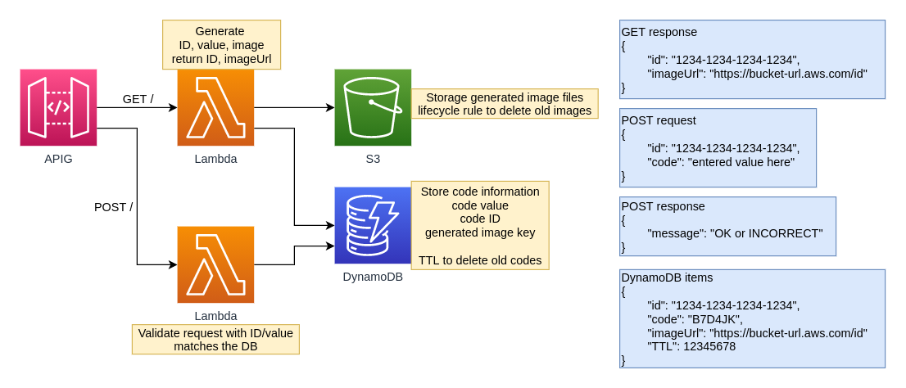

# Lambcha

### Fully serverless CAPTCHA API



### Usage

Send a `GET` request to the endpoint
```json
{
    "id": "20EcBHVy66sV6FV4KGbCWGnZjz3",
    "imageUrl": "endpoint/20EcBHVy66sV6FV4KGbCWGnZjz3"
}
``` 

Application shows the image hosted at the `imageUrl` and the user enters the code they see.

Example image:


The application sends a `POST` request with the details
```json
{
    "id": "20EcBHVy66sV6FV4KGbCWGnZjz3",
    "code": "RJBGB6"
}
```

API returns an HTTP code with a `message` for the response. 
```json
HTTP 200
{
    "message": "OK"
}
```
```json
HTTP 400
{
    "message": "INCORRECT"
}
```

### TODO
- [x] improve api gateway error response formatting
- [x] secure behind api keys
- [x] make image length scale to code length automagically
- [x] return 404 for expired items that still exist in dynamodb
- [ ] generate TTS files on demand using Amazon Polly